# envoluntary

**Automatic Nix development environments for your shell.**

Envoluntary seamlessly loads and unloads Nix development environments based on
directory patterns, eliminating the need for per-project `.envrc` / `flake.nix`
files while giving you centralized control over your development tooling.

This bridges the gap between installing packages declaratively via NixOS /
home-manager and defining them for each project being worked in via `flake.nix`
/ direnv / nix-direnv. Especially useful when projects don't use Nix!

```mermaid
graph TD
    A["🌍 System-Wide Approach<br/>(NixOS/home-manager)"] -->|Pro: Centralized<br/>Con: Loses project specificity| B["Management Challenge"]
    C["📁 Per-Project Approach<br/>(flake.nix/direnv)"] -->|Pro: Project-specific<br/>Con: Setup burden| B
    B -->|Envoluntary Solution| D["✨ Pattern-Based Centralized<br/>(Best of both worlds)"]
    D --> E["✅ Centralized config<br/>✅ Project-aware<br/>✅ No per-project setup<br/>✅ Works for non-Nix projects"]
```



## Features

- **Pattern-based matching**: Define directory patterns once in your config, get
  automatic environment loading everywhere
- **Flake-native**: Built for Nix flakes from the ground up
- **Shell agnostic**: Works with bash, zsh, and fish
- **Fast caching**: Profiles are cached and only rebuilt when needed
- **Zero per-project setup**: No `.envrc` files to commit or maintain

## Quick Start

1. **Install**:

   ```bash
   cargo install envoluntary
   ```

   Or use via Nix shell

   ```bash
   nix shell github:dfrankland/envoluntary -c envoluntary --help
   ```

2. **Add the shell hook** to your `.bashrc`, `.zshrc`, or `config.fish`:

   ```bash
   # Bash/Zsh
   eval "$(envoluntary shell hook bash)"  # or zsh

   # Fish
   envoluntary shell hook fish | source
   ```

   Or use via Nix shell

   ```bash
   # Bash/Zsh
   eval "$(nix shell github:dfrankland/envoluntary -c envoluntary shell hook bash)"  # or zsh

   # Fish
   nix shell github:dfrankland/envoluntary -c envoluntary shell hook fish | source
   ```

3. **Configure your environments** in `~/.config/envoluntary/config.toml`:

   ```toml
   [[entries]]
   pattern = ".*/projects/my-website(/.*)?"
   flake_reference = "~/nix-dev-shells/nodejs"
   # Set whether the flake is impure
   impure = true

   [[entries]]
   # Patterns can match on tilde too
   pattern = "~/projects/rust-.*"
   flake_reference = "github:NixOS/templates/30a6f18?dir=rust"

   # Adjacent files or directories can be used to narrow pattern matches
   [[entries]]
   pattern = ".*"
   pattern_adjacent = ".*/Cargo\\.toml"
   flake_reference = "github:NixOS/templates/30a6f18?dir=rust"
   ```

4. **Navigate** to a matching directory and your environment loads automatically!

## Installing with Nix

The `envoluntary` flake exports a Nix overlay, making it easy to integrate into
your own Nix flake.

### About the Flake

The `flake.nix` in this repository is a [flake-parts](https://flake.parts/)
module that:

- Exports the `envoluntary` package as its `defaultPackage`
- Provides an overlay that makes `envoluntary` available in your own flakes

### Using the Overlay

To use `envoluntary` in your own `flake.nix`, follow these steps:

#### 1. Add the input

Add `envoluntary` to your flake inputs:

```nix
{
  description = "Your flake description";

  inputs = {
    nixpkgs.url = "github:NixOS/nixpkgs/nixpkgs-unstable";
    envoluntary = {
      url = "github:dfrankland/envoluntary";
      inputs.nixpkgs.follows = "nixpkgs";
    };
  };

  outputs = { self, nixpkgs, envoluntary }:
    # ... rest of your flake
}
```

#### 2. Apply the overlay

Apply the overlay to your `pkgs`:

```nix
outputs = { self, nixpkgs, envoluntary }:
  let
    system = "x86_64-linux"; # or your system
    pkgs = import nixpkgs {
      inherit system;
      overlays = [ envoluntary.overlays.default ];
    };
  in {
    # Now pkgs.envoluntary is available
  }
```

#### 3. Use in your environment

You can now use `envoluntary` in your development shell or system configuration:

```nix
devShells.default = pkgs.mkShell {
  buildInputs = [ pkgs.envoluntary ];
};
```

## Configuration

### Adding entries

Manually edit your config file:

```bash
envoluntary config edit
```

Or add entries via the CLI:

```bash
envoluntary config add-entry ".*/my-project(/.*)?" ./path/to/flake
```

### Testing patterns

See which entries match a given path:
```bash
envoluntary config print-matching-entries /home/user/projects/homelab
```

### Flake references

Any valid Nix flake reference works:

- Paths: `~/my-flakes/devshell` or `/home/my-user/devshell`
- GitHub repos: `github:owner/repo` or `github:owner/repo/branch`
- Git repos: `git+https://example.com/repo.git`

See the [Nix flake reference documentation](https://nix.dev/manual/nix/latest/command-ref/new-cli/nix3-flake#flake-references) for more options.

## Advanced Usage

### Force profile updates

When your flake changes:

```bash
envoluntary shell export bash --force-update | source
```

Or just `cd` to a different directory and back—the hook will detect the stale cache.

### Override with explicit flakes

Test an environment without modifying your config:

```bash
envoluntary shell export bash --flake-references ~/test-flake | source
```

### Debugging

Check which Nix version you're using:

```bash
envoluntary shell check-nix-version
```

Inspect cache locations:

```bash
envoluntary shell print-cache-path --flake-reference ~/my-flake
```

View your config file path:

```bash
envoluntary config print-path
```

## Why should you use this?

### The problem

Many projects do not use Nix and adding `flake.nix` to each project can be bothersome.

Additionally, If you use NixOS or home-manager, your system packages are
declaratively managed. But when you need project-specific tools, you typically
reach for one of these solutions:

- **direnv + nix-direnv**: Requires a `.envrc` file in every project directory
- **Manual `nix develop`**: Forces you to remember to enter shells explicitly
- **Per-project flakes**: Scatters your development environment definitions
  across your filesystem

Each approach has drawbacks: `.envrc` files become noise in your repositories,
manual shells break your workflow, and scattered flakes make environment
management inconsistent.

### The solution

Envoluntary centralizes your development environment configuration while
maintaining automatic activation. Define your patterns once, and every matching
directory gets the right environment—no per-project files needed.

**Perfect for:**

- Maintaining consistent dev environments across multiple related projects
- Organizations with standardized tooling per project type
- Developers who want declarative control without repository clutter
- Anyone using NixOS/home-manager who wants the same philosophy for dev shells

**Not ideal for:**

- Projects where the environment definition should be version-controlled alongside code
- Shared repositories where other developers need easy access to the same environment
- One-off projects where you're fine with manual `nix develop`

## Prior Art

Envoluntary stands on the shoulders of giants:

### [direnv](https://github.com/direnv/direnv/)

**Similarity**: Both tools automatically load environment variables when
entering directories.

**Difference**: direnv requires per-directory `.envrc` files and is language-
agnostic. Envoluntary uses centralized pattern-based config and is specifically
built for Nix flakes.

**Attribution**: All the shell integrations are adopted from direnv.

### [nix-direnv](https://github.com/nix-community/nix-direnv)

**Similarity**: Both integrate Nix development shells with automatic directory-
based loading.

**Difference**: nix-direnv extends direnv to work efficiently with Nix, but
still requires `.envrc` files. Envoluntary eliminates per-directory
configuration entirely through pattern matching.

**Attribution**: All Nix dev env caching logic is based on nix-direnv's.

### [flake_env](https://git.sr.ht/~bryan_bennett/flake_env/)

**Similarity**: Same similarities as nix-direnv, but flake_env is also portable.

**Difference**: Same differences as nix-direnv.

**Attribution**: Core concepts and some implementation patterns were adapted from
flake_env.

### [envy](https://github.com/mre/envy/)

**Similarity**: Both use pattern-based matching to automatically load environments.

**Difference**: envy focuses on simple environment variable files, while
Envoluntary leverages the full power of Nix flakes for reproducible development environments.

**Attribution**: The pattern-matching approach and CLI structure drew
inspiration from envy's design.

## Contributing

Contributions welcome! Please open an issue or pull request.
